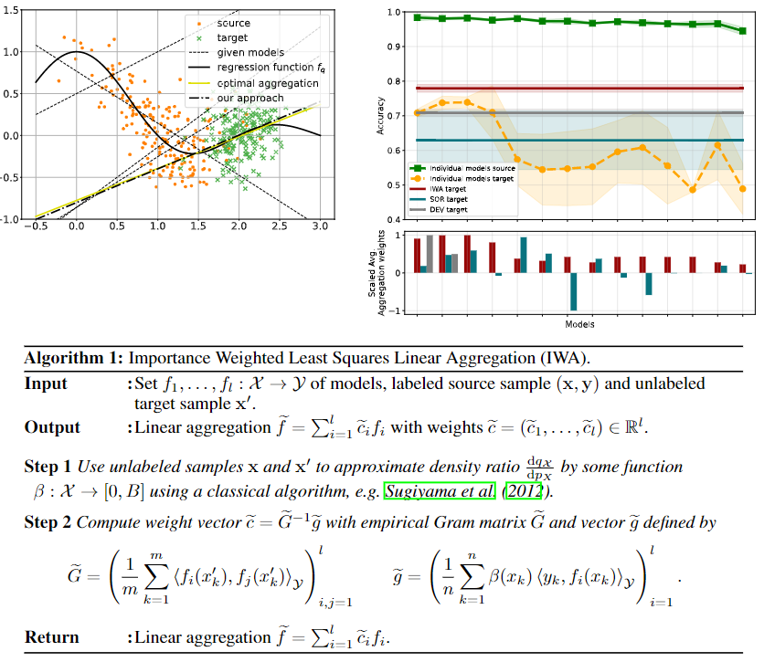

# Addressing Parameter Choice Issues in Unsupervised Domain Adaptation by Aggregation [[Paper](https://openreview.net/forum?id=M95oDwJXayG)]



A PyTorch suite to systematically evaluate different domain adaptation methods.
 
## Requirmenets:
- Python3
- Pytorch==1.7
- Numpy==1.20.1
- scikit-learn==0.24.1
- Pandas==1.2.4
- skorch==0.10.0 (For DEV risk calculations)
- openpyxl==3.0.7 (for classification reports)
- Wandb=0.12.7
- Hydra=1.2.0
- OmegaConf=2.2.3

## Installing

1. Clone repository
```bash
git clone git@github.com:<repo>
cd bpda
```

2. Create a python 3 conda environment
```bash
conda env create -f environment.yml
```

4. Ensure that all required temp directories are available
  * `data`

## Datasets

### Available Datasets
We used four public datasets in this study. We also provide the **preprocessed** versions as follows:
- [Moons](https://scikit-learn.org/stable/modules/generated/sklearn.datasets.make_moons.html)
- [Amazon Reviews](https://jmcauley.ucsd.edu/data/amazon/)
- [DomainNet](http://ai.bu.edu/M3SDA/)
- [Sleep-EDF](https://researchdata.ntu.edu.sg/privateurl.xhtml?token=9f854e11-4384-44d4-bad8-9d2894c76f07)
- [UCIHAR](https://researchdata.ntu.edu.sg/dataset.xhtml?persistentId=doi:10.21979/N9/0SYHTZ)
- [HHAR](https://researchdata.ntu.edu.sg/privateurl.xhtml?token=e44f10b6-e160-4e63-8fcf-8060aadbd3e5)
- [WISDM](https://researchdata.ntu.edu.sg/privateurl.xhtml?token=55e459de-c9d7-470f-8453-ad086c304f9d)

### Adding New Dataset

#### Structure of data
To add new dataset (*e.g.,* NewData), it should be placed in a folder named: NewData in the datasets directory.

Since "NewData" has several domains, each domain should be split into train/test splits with naming style as
"train_*x*.pt" and "test_*x*.pt".

The structure of data files should in dictionary form as follows:
`train.pt = {"samples": data, "labels: labels}`, and similarly for `test.pt`.

#### Configurations
Next, you have to add a class with the name NewData in the `configs/data_model_configs.py` file. 
You can find similar classes for existing datasets as guidelines. 
Also, you have to specify the cross-domain scenarios in `self.scenarios` variable.

Last, you have to add another class with the name NewData in the `configs/hparams.py` file to specify
the training parameters.


## Domain Adaptation Algorithms
### Existing Algorithms
- [Deep Coral](https://arxiv.org/abs/1607.01719)
- [MMDA](https://arxiv.org/abs/1901.00282)
- [DANN](https://arxiv.org/abs/1505.07818)
- [CDAN](https://arxiv.org/abs/1705.10667)
- [DIRT-T](https://arxiv.org/abs/1802.08735)
- [DSAN](https://ieeexplore.ieee.org/document/9085896)
- [HoMM](https://arxiv.org/pdf/1912.11976.pdf)
- [DDC](https://arxiv.org/abs/1412.3474)
- [CoDATS](https://arxiv.org/pdf/2005.10996.pdf)
- [AdvSKM](https://www.ijcai.org/proceedings/2021/0378.pdf)
- [CMD](https://openreview.net/pdf?id=SkB-_mcel)


### Adding New Algorithm
To add a new algorithm, place it in `algorithms/algorithms.py` file.


## Training procedure

### To train the models run:

```bash
./run.sh
```

### To collect the results run:

```bash
./collect_results.sh
```

### Upper and Lower bounds
Main trainer file is `trainer.py` and includes also source-only results when executed.

## Results
- Each run will have all the cross-domain scenarios results in the format `runx_src_to_trg`, where `x`
is the run_id. 
- Under each directory, you will find the classification report, a log file, checkpoint, 
and the different risks scores.
- By the end of the all the runs, you will find the overall average and std results in the run directory.


## References

* [Moment Matching for Multi-Source Domain Adaptation](http://ai.bu.edu/M3SDA/)
* [Amazon product data](https://jmcauley.ucsd.edu/data/amazon/)
* [Unsupervised Domain Adaptation by Backpropagation](https://github.com/fungtion/DANN)
* [Towards Accurate Model Selection in Deep Unsupervised Domain Adaptation](https://github.com/thuml/Deep-Embedded-Validation)
* [The balancing principle for parameter choice in distance-regularized domain adaptation](https://github.com/Xpitfire/bpda)

## Citation

```latex
@inproceedings{
  IWA23,
  title={Addressing Parameter Choice Issues in Unsupervised Domain Adaptation by Aggregation},
  author={Dinu, Marius-Constantin and Beck, Maximilian and Nguyen, Duc Hoan and Huber, Andrea and Eghbal-zadeh, Hamid and Moser, Bernhard A. and Pereverzyev, Sergei V. and Hochreiter, Sepp and Zellinger, Werner},
  booktitle={Submitted to The Eleventh International Conference on Learning Representations },
  year={2023},
  url={https://openreview.net/forum?id=M95oDwJXayG},
  note={under review}
}
```
